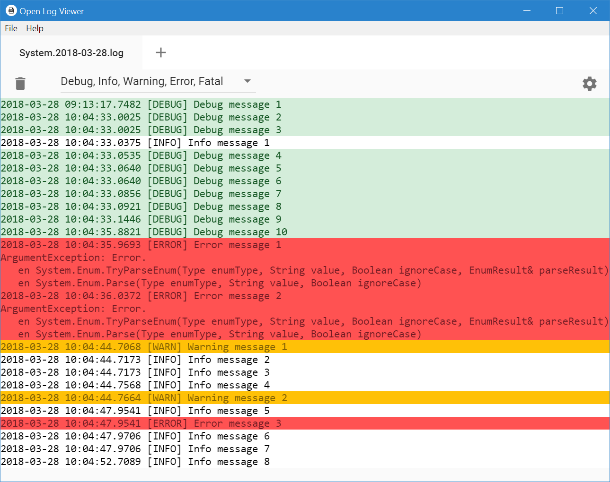

<h1 align="center">
    
    <br>
    Open Log Viewer
</h1>

<h4 align="center">
    A multi-platform log viewer built with <a href="http://electron.atom.io" target="_blank">Electron</a> and styled with Material Design.
</h4>

<p align="center">
    <a href="#key-features">Key Features</a> •
    <a href="#installation">Installation</a> •
    <a href="#download">Download</a> •
    <a href="#release-notes">Release Notes</a> •
    <a href="#credits">Credits</a> •
    <a href="#license">License</a>
</p>



## Key Features

* Multiple opened files in tabs.
* Tail file changes.
* Filter log levels.
* Colored log entries.
* Customize log levels pattern.
* Customize log levels color.
* Cross platform
  - Windows, macOS and Linux ready.

## Installation

```bash
# Clone this repository
$ git clone https://github.com/tmoreno/open-log-viewer

# Go into the repository
$ cd open-log-viewer

# Install dependencies
$ npm install

# Build app
$ npm run build

# Run the app
$ npm run start
```

## Download

Open Log Viewer is available for Linux, Mac and Windows

macOS | Windows | Linux
-----------------| ---| ---|
<a href='https://github.com/tmoreno/open-log-viewer/releases/download/1.1.2/open-log-viewer_1.1.2.dmg'>Download</a> | <a href='https://github.com/tmoreno/open-log-viewer/releases/download/1.1.2/open-log-viewer_1.1.2.exe'>Download</a> | <a href='https://github.com/tmoreno/open-log-viewer/releases/download/1.1.2/open-log-viewer_1.1.2.deb'>Debian-based</a> |
| | | <a href='https://github.com/tmoreno/open-log-viewer/releases/download/1.1.2/open-log-viewer_1.1.2.rpm'>RedHat-based</a> |

## Release Notes

### Version 1.1.2

#### Bugs Fixed
- When there are more than one file opened then files with no line matches has the previous severity color.

### Version 1.1.1

#### Bugs Fixed
- If the first line does not match any log severity pattern, then the viewer was empty.

### Version 1.1.0

#### Improvements
- Enabled search feature. Press Ctrl+F or Command+F to find words or text in the log file.
- Show line numbers.  

#### Drawbacks
- Color and patterns settings are global instead of by file.
- Changes on patterns are applied after restarting the application.
- Color and pattern settings are not migrated to this version, so you will lost them.

## Credits

This software uses the following open source packages:

- [Electron](http://electron.atom.io/)
- [Node.js](https://nodejs.org/)
- [Vue](https://vuejs.org/)
- [Vuetify](https://vuetifyjs.com/)
- [Ace](https://ace.c9.io/)

## License

This project is licensed under the GPLv3 License - see the [LICENSE](LICENSE) file for details

---
> Tomás Moreno Bernal &nbsp;&middot;&nbsp;
> GitHub [@tmoreno](https://github.com/tmoreno) &nbsp;&middot;&nbsp;
> Twitter [@tmorenobernal](https://twitter.com/tmorenobernal)
